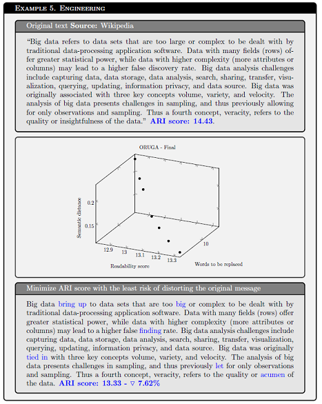

# ORUGA
Optimizing Readability Using Genetic Algorithms

 This repository contains code for reproducing the experiments reported in the paper
- Jorge Martinez-Gil, "Optimizing Readability Using Genetic Algorithms," [[arXiv preprint]](https://arxiv.org/abs/2301.00374), Jan 2023
 
ORUGA is a method that seeks to optimize the readability of any text automatically. It is based on genetic algorithms, so it is unsupervised and requires no training.



# Install
``` pip install -r requirements.txt```

# Dataset
```texts.txt```
Ten texts extracted from Wikipedia with different lengths, topics and readability levels.

# Use
``` python oruga_wordnet.py```
Run the basic ORUGA program looking to minimize the FKGL score using the WordNet synonym library.

``` python oruga_word2vec.py```
Run the basic ORUGA program looking to minimize the FKGL score using the word2vec synonym method. (Slow)

``` python oruga_webscraping.py```
Run the basic ORUGA program looking to minimize the FKGL score using webscraping. (Please be responsible)

``` python oruga2_nsga2.py```
Run the second version of ORUGA using NSGA-II to minimize FKGL score and number of words to be replaced simultaneously.

``` python oruga2_gde3.py```
Run the second version of ORUGA using GDE3 to minimize FKGL score and number of words to be replaced simultaneously.

``` python oruga2_nsga2_wmd.py```
Run the third version of ORUGA using NSGA-II to minimize FKGL score, the number of words to be replaced simultaneously, and WMD for semantic distance.

``` python oruga2_gde3_wmd.py```
Run the third version of ORUGA using GDE3 to minimize FKGL score and number of words to be replaced simultaneously, and WMD for semantic distance.
 
## Citation
If you use ORUGA, please cite:

```
@inproceedings{martinez2023,
  author    = {Jorge Martinez-Gil},
  title     = {Optimizing Readability Using Genetic Algorithms},
  journal   = {CoRR},
  volume    = {abs/2301.00374},
  year      = {2023},
  url       = {https://arxiv.org/abs/2301.00374},
  doi       = {https://doi.org/10.48550/arXiv.2301.00374},
  eprinttype = {arXiv},
  eprint    = {2301.00374},
  timestamp = {Tue, 03 Jan 2023 13:33:09 +0200},
}

```
  
## License
MIT