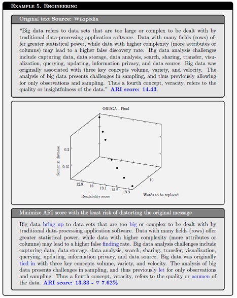

# ORUGA: Optimizing Readability Using Genetic Algorithms

[](https://doi.org/10.1016/j.knosys.2023.111273)
[](https://www.sciencedirect.com/journal/knowledge-based-systems)
[](LICENSE)
[](https://www.python.org/)

**ORUGA** (**O**ptimizing **R**eadability **U**sing **G**enetic **A**lgorithms)
is an open framework for **automatic, semantics-preserving readability
optimization** and for **benchmarking text-simplification methods**. It treats
simplification as a search problem: choose word replacements that make a text
easier to read (lower FKGL / SMOG / Coleman-Liau / ...) while changing as little
meaning as possible.

This repository is the **official implementation** of:

> Jorge Martinez-Gil. *Optimizing readability using genetic algorithms.*
> Knowledge-Based Systems, 284:111273, 2024.
> [https://doi.org/10.1016/j.knosys.2023.111273](https://doi.org/10.1016/j.knosys.2023.111273)



---

## Table of contents

- [What problem does this solve?](#what-problem-does-this-solve)
- [Why optimize readability automatically?](#why-optimize-readability-automatically)
- [Why evolutionary computation?](#why-evolutionary-computation)
- [How does ORUGA differ from LLM-based simplification?](#how-does-oruga-differ-from-llm-based-text-simplification)
- [Installation](#installation)
- [Quickstart](#quickstart)
- [Command-line interface](#command-line-interface)
- [Architecture](#architecture)
- [Optimize your own documents](#optimize-your-own-documents)
- [Benchmark a new simplification algorithm](#benchmark-a-new-simplification-algorithm)
- [Reproduce the published experiments](#reproduce-the-published-experiments)
- [Citation](#citation)
- [Contributing](#contributing)
- [License](#license)

---

## What problem does this solve?

Millions of documents — health leaflets, legal contracts, government forms,
educational material, scientific abstracts — are written far above the reading
level of their audience. ORUGA automatically rewrites a text to a **lower
reading grade** by substituting hard words with simpler, meaning-preserving
alternatives, and reports exactly how much readability improved and how much the
text changed.

## Why optimize readability automatically?

Manual simplification is slow, inconsistent and expensive. An automatic,
**metric-driven** optimizer gives reproducible, measurable improvements and can
process large corpora in batch — useful for publishers, accessibility teams,
public administrations and healthcare communicators.

## Why evolutionary computation?

Choosing which words to replace, and with which synonym, is a large combinatorial
search with multiple competing goals (readability vs. meaning vs. amount of
change). Evolutionary and swarm algorithms:

- need **no training data or GPUs** — they work directly on a single document;
- optimize **non-differentiable** objectives (readability formulas) directly;
- are naturally **multi-objective**, returning a *Pareto front* of trade-offs
  instead of a single answer;
- are **transparent** — every change is an explicit, inspectable word choice.

## How does ORUGA differ from LLM-based text simplification?

| | ORUGA | LLM rewriting |
| :--- | :--- | :--- |
| Training data | None | Large corpora |
| Hardware | CPU | Usually GPU |
| Control of target metric | Direct (optimizes FKGL/SMOG/...) | Indirect (prompted) |
| Meaning preservation | Explicit objective + measurable | Implicit |
| Output | Pareto front of trade-offs | Single rewrite |
| Explainability | Every edit is a traceable word choice | Opaque |
| Hallucination risk | None (only swaps real synonyms) | Possible |

ORUGA and LLMs are complementary; ORUGA is a strong, reproducible, dependency-light
**baseline and evaluation harness** that LLM methods can be compared against.

---

## Installation

```bash
git clone https://github.com/jorge-martinez-gil/oruga.git
cd oruga
pip install -e .                 # core engine (only needs NumPy)
```

Optional capabilities are installed as extras, so you only pull what you use:

```bash
pip install -e ".[wordnet]"      # WordNet synonyms (NLTK)
pip install -e ".[word2vec]"     # Word2Vec synonyms + Word Mover's Distance
pip install -e ".[web]"          # web-thesaurus synonyms
pip install -e ".[jmetal]"       # NSGA-II / GDE3 / SMPSO
pip install -e ".[pygad]"        # paper-faithful single-objective GA
pip install -e ".[grammar]"      # LanguageTool post-correction (needs Java)
pip install -e ".[dev]"          # tests + cross-validation
pip install -e ".[all]"          # everything
```

For WordNet, also download the corpus once:
`python -m nltk.downloader wordnet omw-1.4`.

---

## Quickstart

```python
from oruga import optimize

report = optimize(
    "The committee deliberated extensively regarding the ramifications "
    "of the proposed legislation.",
    provider="wordnet",     # dictionary | wordnet | word2vec | web
    optimizer="ga",         # ga | nsga2 | gde3 | smpso | jaya | cuckoo | tlbo | pygad | random
    metric="fkgl",          # fkgl | flesch | smog | coleman_liau | ari | gunning_fog
    modification=True,      # also minimize how many words are changed
    seed=0,
)

print(report.optimized_text)
print("FKGL", report.metrics_before["fkgl"], "->", report.metrics_after["fkgl"])
```

No optional dependencies? Use the built-in dictionary provider and the built-in
GA — it runs anywhere:

```bash
python examples/quickstart.py
```

---

## Command-line interface

```bash
oruga optimize --text "The committee deliberated extensively." \
    --provider wordnet --optimizer ga --metric fkgl --modification --seed 0

oruga optimize --config examples/config.example.yaml --file mydoc.txt --json

oruga metrics  --text "Score this passage."        # all readability metrics
oruga list                                         # providers, optimizers, metrics
```

---

## Architecture

ORUGA used to be ~27 near-identical scripts. It is now one composable engine:

```
text + SynonymProvider  ->  CandidateText        (encoding: which words, which synonyms)
                        ->  OrugaProblem          (objectives: readability + modification + semantics)
                        ->  Optimizer             (GA / NSGA-II / GDE3 / SMPSO / Jaya / Cuckoo / TLBO / ...)
                        ->  OptimizationReport    (before/after metrics + Pareto front)
```

Every axis is pluggable and selectable by string or config file:

| Component | Options |
| :--- | :--- |
| Synonym provider | `dictionary`, `wordnet`, `word2vec`, `web` |
| Readability metric | `fkgl`, `flesch`, `smog`, `coleman_liau`, `ari`, `gunning_fog` |
| Objectives | readability; + modification rate; + semantic distance (Jaccard or WMD) |
| Optimizer | `random`, `ga`, `jaya`, `cuckoo`, `tlbo`, `pygad`, `nsga2`, `gde3`, `smpso` |

The readability metrics are implemented in pure Python (no `readability-lxml`
namespace conflict) and **cross-validated against an independent library**
(see `tests/test_readability.py`).

---

## Optimize your own documents

```python
from oruga import optimize_corpus, OrugaConfig

cfg = OrugaConfig(provider="wordnet", optimizer="nsga2",
                  modification=True, seed=0)

with open("documents.txt") as f:
    docs = [line.strip() for line in f if line.strip()]

for report in optimize_corpus(docs, config=cfg):
    print(report.improvement("fkgl"), report.optimized_text)
```

---

## Benchmark a new simplification algorithm

Already have a method (rule-based, LLM, your own optimizer)? Score its output
with the **same metrics** ORUGA uses, so results are directly comparable:

```python
from oruga import readability as rd

original  = "The committee deliberated extensively regarding the ramifications."
yours     = my_method(original)

print("FKGL  ", rd.score(original, "fkgl"),  "->", rd.score(yours, "fkgl"))
print("SMOG  ", rd.score(original, "smog"),  "->", rd.score(yours, "smog"))
print("Flesch", rd.score(original, "flesch"),"->", rd.score(yours, "flesch"))
```

To plug a brand-new optimizer into the engine, subclass `oruga.optimizers.base.Optimizer`
and register it — it then works with every provider, metric and objective.

---

## Reproduce the published experiments

The original paper scripts are preserved unmodified under
[`legacy/`](legacy/README.md) and remain exactly reproducible. The same
experiments can also be run through the new engine:

```bash
python examples/reproduce_paper.py
```

---

## Citation

If you use this framework, please cite:

```bibtex
@article{martinez2024oruga,
    author  = {Jorge Martinez-Gil},
    title   = {Optimizing readability using genetic algorithms},
    journal = {Knowledge-Based Systems},
    volume  = {284},
    pages   = {111273},
    year    = {2024},
    issn    = {0950-7051},
    doi     = {10.1016/j.knosys.2023.111273}
}
```

Background reading (Medium series):
[Part 1](https://medium.com/@jorgemarcc/readability-optimization-in-python-1-3-4491a5216cf0)
· [Part 2](https://medium.com/@jorgemarcc/readabilty-optimization-in-python-2-3-39a4bc4e98e)
· [Part 3](https://medium.com/@jorgemarcc/readability-optimization-in-python-3-3-7cbe204cafef)

---

## Contributing

Contributions are welcome — new synonym providers, optimizers, metrics, datasets
and benchmarks especially. See [CONTRIBUTING.md](CONTRIBUTING.md).

## License

MIT — see [LICENSE](LICENSE).

---

*Keywords: automatic readability optimization, text readability optimization,
genetic algorithm readability, readability benchmark, text simplification
benchmark, readability evaluation, semantic-preserving simplification,
evolutionary text simplification, FKGL optimization, accessibility NLP.*
